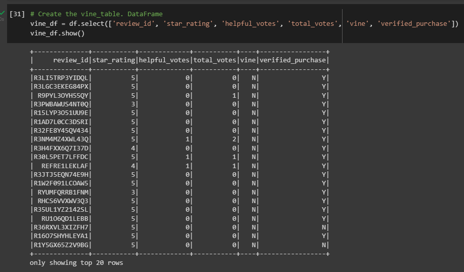

# Amazon_Vine_Analysis

The purpose of this project is analyzing Amazon reviews written by members of the paid Amazon Vine program. The Amazon Vine program is a service that allows manufacturers and publishers to receive reviews for their products. Companies can pay a small fee to Amazon and provide products to Amazon Vine members, who are then required to publish a review.

In this project, a dataset is chosen which contains reviews of a specific product. From this datasets PySpark is used to perform the ETL process to extract the dataset, transform the data, connect to an AWS RDS instance, and load the transformed data into pgAdmin. Then, using PySpark, it is determined if there is any bias toward favorable reviews from Vine members in the dataset.

## Deliverable 1: Perform ETL on Amazon Product Reviews
Using the cloud ETL process, an AWS RDS database is created with tables from pgAdmin and data from the Amazon Review datasets is extracted into a DataFrame. This DataFrame is then transformed into four separate DataFrames that match the table schema in pgAdmin. Finally, the transformed data is uploaded/published into the appropriate tables in the database.  Queries in pgAdmin are then run to confirm that the data has been uploaded.

The following screenshots show the final DataFrames created, followed by the connection to the AWS database, then the queries from pgAdmin indicating the database tables were populated correctly.

- PySpark Customers Dataframe 
 
- PySpark Products Dataframe 
 
- PySpark Review ID Dataframe 
 
- PySpark Vine Dataframe 
 
- RDS Connection
  
- PySpark Customers Table 
 
- PySpark Products Table 
 
- PySpark Review ID Table 
 
- PySpark Vine Table 
 

## Deliverable 2: Determine Bias of Vine Reviews

### Overview of the analysis: 
Using PySpark, determine if there is any bias towards reviews that were written as part of the Vine program and if having a paid Vine review makes a difference in the percentage of 5-star reviews.

The entire data set is first filtered to create a DataFrame where a reviewer had a total of 20 or more total votes to eliminate un-reliable data.  The data is then filtered to create a DataFrame where the percentage of helpful_votes is equal to or greater than 50%.  From this filtered data the following analysis was completed.

### Results: 
The following questions were answered with this analysis:
- How many Vine reviews and non-Vine reviews were there?
    - The Vine (Paid) had a total of 7 reviews
    - The non-Vine (unPaid) had a total of 105,979 reviews
- How many Vine reviews were 5 stars? How many non-Vine reviews were 5 stars?
    - There were 0 Vine reviews that were 5 stars
    - There were 67,580 non-Vine reviews that were 5 stars
- What percentage of Vine reviews were 5 stars? What percentage of non-Vine reviews were 5 stars?
    - 0% of the Vine reviews were 5 stars
    - 63.8% of the non-Vine reviews were 5 stars

### Summary: 
In summary, the data does not support showing any positivity bias for reviews in the Vine program. Overall, there isn't enough data points to make a clear assumption on this dataset this since there were only 7 reviews in the Vine program after the initial filters were put into place, however, the data we do have does not indicate there is a positivity bias.

To further the pursuit of this theory, analysis could be run on additional datasets to see if the outcome produces similar results.  These additional datasets can utilize the same initial filtering criteria as used in this analysis, plus the initial filtering could be loosened to provide more values of the Vine program and show if there is any correlation between favorability bias and the Vine program. 